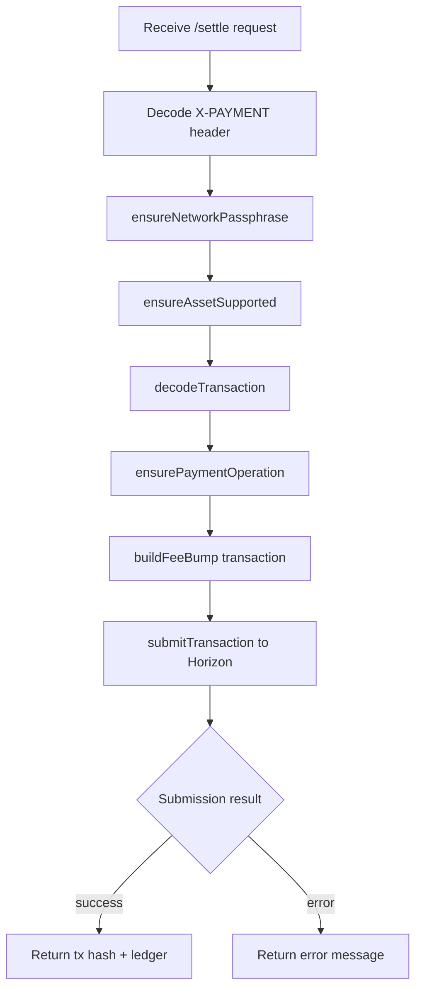
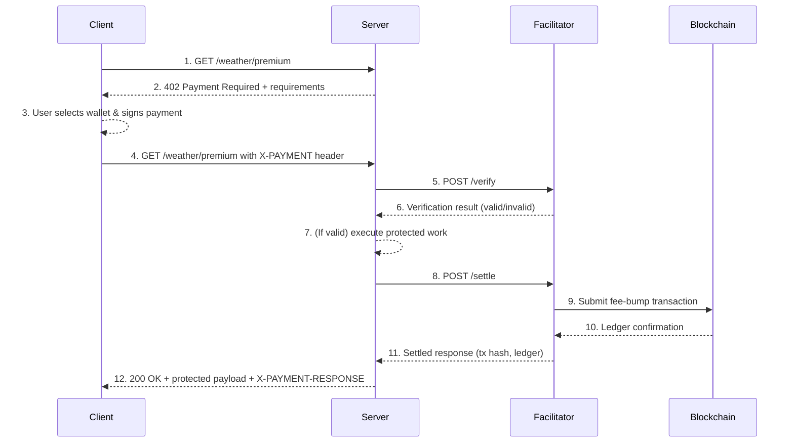

# Stellar x402 GPT Workspace

This workspace hosts the Stellar extension for the x402 protocol, implemented under the `GPT implementation` tree to keep changes scoped and auditable. It contains the facilitator service, resource-server middleware, shared client utilities, and a paywall demo that exercise the complete 402 payment flow on Stellar testnet.

## Packages & Apps

- `packages/facilitator-stellar`: Node/TypeScript service exposing `/supported`, `/verify`, and `/settle` endpoints against Stellar testnet.
- `packages/client-stellar`: Shared TypeScript utilities for building Stellar `X-PAYMENT` payloads, wallet adapters, and Soroban helpers.
- `packages/middleware-resource-stellar`: Resource-server middleware (Express/Hono) that orchestrates facilitator verification and settlement.
- `apps/paywall-stellar`: Demo paywall web app showing wallet connect → pay → unlock flow.
- `apps/resource-server-stellar`: Example Express resource server protecting `/weather/premium` with the middleware.

## Guiding References

- `docs/stellar_x402_design.md`: End-to-end design and architectural goals.
- `docs/stellar_review_checklist.md`: Acceptance criteria ensuring parity with the Solana implementation.
- `research/*`: Supporting notes on Stellar constraints, component mapping, and Solana parity targets.

## Quick Start

```bash
cd "GPT implementation"
pnpm install

# Terminal 1 – facilitator (port 4021)
FEE_SPONSOR_SECRET=SA... \
SUPPORTED_ASSETS="USDC:GBBD47IF6LWK7P7MDEVSCWR7DPUWV3NY3DTQEVFL4NAT4AQH3ZLLFLA5,XLM" \
pnpm --filter @stellar-x402/facilitator-stellar dev

# Terminal 2 – resource server (port 4022)
PAY_TO=G... \
FEE_SPONSOR=G... \
pnpm --filter @stellar-x402/resource-server-stellar dev

# Terminal 3 – paywall UI (Vite, port 5173)
pnpm --filter @stellar-x402/paywall-stellar dev
```

Visit `http://localhost:5173/`, request the premium resource, connect a testnet wallet (Freighter, Albedo, etc.), and follow the on-screen prompts to complete the payment. The paywall encodes the signed transaction into an `X-PAYMENT` header, the resource server relays it to the facilitator, and the protected content unlocks after settlement.

### Facilitator Internals



### End-to-End Sequence



1. **Client requests the resource** – the paywall hits `/weather/premium` with no payment header yet.
2. **Resource server challenges** – middleware returns `402 Payment Required` and includes the payment requirements payload.
3. **User signs the payment** – the client prompts the wallet, which signs a Stellar payment transaction matching the requirements.
4. **Client retries with `X-PAYMENT`** – the original request is retried, now including the base64-encoded `X-PAYMENT` header containing the signed transaction.
5. **Server calls facilitator `/verify`** – middleware forwards the header + requirements so the facilitator can validate the transaction details.
6. **Facilitator responds with verification** – it returns whether the transaction is valid (amount, asset, destination, time bounds, etc.). Failures stop here with another 402.
7. **Server performs protected work** – assuming verification passed, the server generates or fetches the premium content.
8. **Server calls facilitator `/settle`** – middleware asks the facilitator to settle the transaction.
9. **Facilitator submits fee-bump transaction** – the facilitator wraps the user’s signed transaction in a fee-bump and sends it to Horizon, paying the fees via the sponsor account.
10. **Ledger confirms submission** – Horizon (Stellar network) processes the fee-bump transaction and returns the result.
11. **Facilitator returns settlement details** – it sends back the transaction hash, ledger, and success flag to the server.
12. **Server responds to client** – the server returns `200 OK`, the protected resource payload, and an `X-PAYMENT-RESPONSE` header so the client can replay the payment if needed.

## Facilitator API Reference

The facilitator service in `packages/facilitator-stellar` exposes a minimal REST API that satisfies the x402 payment flow on Stellar testnet or mainnet. All endpoints return JSON and require `Content-Type: application/json` for requests with a body.

### Base URLs

- Development (default): `http://localhost:4021`
- Environment variable overrides: `PORT` (fallback `4021`)

### GET `/health`

Operational status check.

**Response**

```json
{
  "status": "ok",
  "service": "stellar-facilitator"
}
```

### GET `/supported`

Lists the payment kinds supported by this facilitator instance. The response is derived from the configuration and aligns with the x402 spec’s SupportedKinds schema.

**Response**

```json
{
  "kinds": [
    {
      "x402Version": 1,
      "scheme": "exact",
      "network": "stellar-testnet"
    }
  ]
}
```

### POST `/verify`

Validates a proposed payment against the requirements the resource server returned to the client. Use this before performing any protected work.

- Ensures the payload matches the facilitator’s supported scheme/network.
- Confirms the signed transaction aligns with `paymentRequirements` (amount, asset, destination, memo, time bounds, etc.).

**Request Body**

```json
{
  "paymentPayload": {
    "x402Version": 1,
    "scheme": "exact",
    "network": "stellar-testnet",
    "payload": {
      "signature": "dbbf359a03dcfa9117e85892fecb90971652a531b4db3e7965f1fc7e871f799ef594f3b86a62a3b5a5ae0bc21ccf077bfaf15948eb685e9ee527a5005596ca04",
      "invokeHostOpXDR": "AAAAAgAAAADKBZBfN0sKlKKXLqxlEPLp7Fz2a9XqwQKlBqcHPzQqaAAAAGQAAOzoAAAAAQAAAAEAAAAAAAAAAAAAAAAAAAAAAAAAAAAAAAEAAAAA"
    }
  },
  "paymentRequirements": {
    "scheme": "exact",
    "network": "stellar-testnet",
    "resource": "https://example.com/api/resource",
    "description": "Payment for API access",
    "mimeType": "application/json",
    "maxTimeoutSeconds": 3600,
    "maxAmountRequired": "1000000",
    "payTo": "GCQH2A2MCCW4TU5HKRTP35J2X4V2ZUMTCU75MRULENCFIUIKS4PJ7HHJ",
    "asset": "CBIELTK6YBZJU5UP2WWQEUCYKLPU6AUNZ2BQ4WWFEIE3USCIHMXQDAMA"
  }
}
```

**Success Response**

```json
{
  "isValid": true,
  "payer": "GA42TVHEH5ZR2O3QB5WZ6JY2G6MCX326WC2O2CJC5UIRCUMDL5S4HPT3J"
}
```

**Error Response**

```json
{
  "isValid": false,
  "invalidReason": "invalid_payload"
}
```

Possible `invalidReason` values: `invalid_payload`, `invalid_x402_version`, `unsupported_scheme`, `invalid_network`, `unexpected_verify_error`.

### POST `/settle`

Submits the verified transaction to the Stellar network (wrapping it in a fee-bump that uses the facilitator’s fee sponsor keys).

- Should be called after `/verify` succeeds and the resource server has generated the protected response.
- Returns the result of submission to Horizon, including transaction hash and network.

**Request Body**

```json
{
  "paymentPayload": {
    "x402Version": 1,
    "scheme": "exact",
    "network": "stellar-testnet",
    "payload": {
      "signature": "dbbf359a03dcfa9117e85892fecb90971652a531b4db3e7965f1fc7e871f799ef594f3b86a62a3b5a5ae0bc21ccf077bfaf15948eb685e9ee527a5005596ca04",
      "invokeHostOpXDR": "AAAAAgAAAAA5qdTkP3MdO3APbZ8nGjeYK+9esLTtCSLtERFRg19lwwABblIAFxG2AAAAAQAAAAEAAAAAAAAAAAAAAAAAAAAAAAAAAAAAAAEAAAAAAAAAGAAAAAAAAAABUEXNXsBymnaP1a0CUFhS308Cjc6DDlrFIgm6SEg7LwEAAAAIdHJhbnNmZXIAAAADAAAAEgAAAAAAAAAAOanU5D9zHTtwD22fJxo3mCvvXrC07Qki7RERUYNfZcMAAAASAAAAAAAAAACgfQNMEK3J06dUZv31Or8rrNGTFT/WRosjRFRRCpcenwAAAAoAAAAAAAAAAAAAAAAAAAAUAAAAAQAAAAAAAAAAAAAAAVBFzV7Acpp2j9WtAlBYUt9PAo3Ogw5axSIJukhIOy8BAAAACHRyYW5zZmVyAAAAAwAAABIAAAAAAAAAADmp1OQ/cx07cA9tnycaN5gr716wtO0JIu0REVGDX2XDAAAAEgAAAAAAAAAAoH0DTBCtydOnVGb99Tq/K6zRkxU/1kaLI0RUUQqXHp8AAAAKAAAAAAAAAAAAAAAAAAAAFAAAAAAAAAABAAAAAAAAAAEAAAAGAAAAAVBFzV7Acpp2j9WtAlBYUt9PAo3Ogw5axSIJukhIOy8BAAAAFAAAAAEAAAACAAAAAQAAAAA5qdTkP3MdO3APbZ8nGjeYK+9esLTtCSLtERFRg19lwwAAAAFVU0RDAAAAAEI+fQXy7K+/7BkrIVo/G+lq7bjY5wJUq+NBPgIH3layAAAAAQAAAACgfQNMEK3J06dUZv31Or8rrNGTFT/WRosjRFRRCpcenwAAAAFVU0RDAAAAAEI+fQXy7K+/7BkrIVo/G+lq7bjY5wJUq+NBPgIH3layAAQTzQAAAOgAAADoAAAAAAABbYoAAAAA"
    }
  },
  "paymentRequirements": {
    "scheme": "exact",
    "network": "stellar-testnet",
    "resource": "https://example.com/api/resource",
    "description": "Payment for API access",
    "mimeType": "application/json",
    "maxTimeoutSeconds": 3600,
    "maxAmountRequired": "1000000",
    "payTo": "GCQH2A2MCCW4TU5HKRTP35J2X4V2ZUMTCU75MRULENCFIUIKS4PJ7HHJ",
    "asset": "CBIELTK6YBZJU5UP2WWQEUCYKLPU6AUNZ2BQ4WWFEIE3USCIHMXQDAMA"
  }
}
```

**Success Response**

```json
{
  "success": true,
  "payer": "GA42TVHEH5ZR2O3QB5WZ6JY2G6MCX326WC2O2CJC5UIRCUMDL5S4HPT3",
  "transaction": "AAAAAgAAAADKBZBfN0sKlKKXLqxlEPLp7Fz2a9XqwQKlBqcHPzQqaAAAAGQAAOzoAAAAAQAAAAEAAAAAAAAAAAAAAAAAAAAAAAAAAAAAAAEAAAAA",
  "network": "stellar-testnet"
}
```

**Error Response**

```json
{
  "success": false,
  "errorReason": "invalid_payload",
  "transaction": "",
  "network": "stellar-testnet"
}
```

Possible `errorReason` values: `invalid_payload`, `invalid_x402_version`, `unsupported_scheme`, `invalid_network`, `unexpected_settle_error`.

### Curl Examples

Verify a payment:

```bash
curl -X POST http://localhost:4021/verify \
  -H "Content-Type: application/json" \
  -d '{ ... }'
```

Settle a payment:

```bash
curl -X POST http://localhost:4021/settle \
  -H "Content-Type: application/json" \
  -d '{ ... }'
```

Check supported payment kinds:

```bash
curl http://localhost:4021/supported
```

## Documentation & References

- `docs/stellar_x402_runbook.md` – Operational guide covering setup, configuration, and troubleshooting.
- `docs/stellar_x402_design.md` – End-to-end design and architectural goals.
- `docs/stellar_review_checklist.md` – Acceptance criteria ensuring parity with the Solana implementation.
- `research/*` – Supporting notes on Stellar constraints, component mapping, and Solana parity targets.

## Development Notes

- Use `pnpm` from this directory (`pnpm install`, `pnpm run <script>`) to manage packages.
- All transactions, fixtures, and tests target Stellar **testnet** by default.
- Each implementation milestone should be verified on testnet (or mocks) before moving to the next task.

