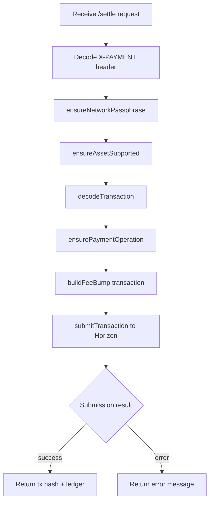
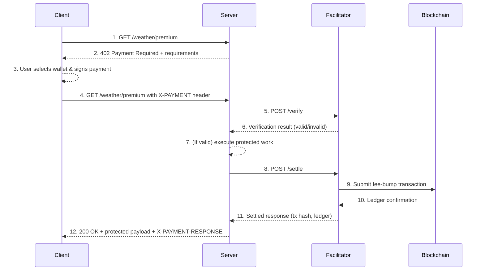

# Stellar x402 GPT Workspace

This workspace hosts the Stellar extension for the x402 protocol, implemented under the `GPT implementation` tree to keep changes scoped and auditable. It contains the facilitator service, resource-server middleware, shared client utilities, and a paywall demo that exercise the complete 402 payment flow on Stellar testnet.

## Packages & Apps

- `packages/facilitator-stellar`: Node/TypeScript service exposing `/supported`, `/verify`, and `/settle` endpoints against Stellar testnet.
- `packages/client-stellar`: Shared TypeScript utilities for building Stellar `X-PAYMENT` payloads, wallet adapters, and Soroban helpers.
- `packages/middleware-resource-stellar`: Resource-server middleware (Express/Hono) that orchestrates facilitator verification and settlement.
- `apps/paywall-stellar`: Demo paywall web app showing wallet connect → pay → unlock flow.
- `apps/resource-server-stellar`: Example Express resource server protecting `/weather/premium` with the middleware.

## Guiding References

- `docs/stellar_x402_design.md`: End-to-end design and architectural goals.
- `docs/stellar_review_checklist.md`: Acceptance criteria ensuring parity with the Solana implementation.
- `research/*`: Supporting notes on Stellar constraints, component mapping, and Solana parity targets.

## Quick Start

```bash
cd "GPT implementation"
pnpm install

# Terminal 1 – facilitator (port 4021)
FEE_SPONSOR_SECRET=SA... \
SUPPORTED_ASSETS="USDC:GBBD47IF6LWK7P7MDEVSCWR7DPUWV3NY3DTQEVFL4NAT4AQH3ZLLFLA5,XLM" \
pnpm --filter @stellar-x402/facilitator-stellar dev

# Terminal 2 – resource server (port 4022)
PAY_TO=G... \
FEE_SPONSOR=G... \
pnpm --filter @stellar-x402/resource-server-stellar dev

# Terminal 3 – paywall UI (Vite, port 5173)
pnpm --filter @stellar-x402/paywall-stellar dev
```

Visit `http://localhost:5173/`, request the premium resource, connect a testnet wallet (Freighter, Albedo, etc.), and follow the on-screen prompts to complete the payment. The paywall encodes the signed transaction into an `X-PAYMENT` header, the resource server relays it to the facilitator, and the protected content unlocks after settlement.

### Facilitator Internals



### End-to-End Sequence



## Documentation & References

- `docs/stellar_x402_runbook.md` – Operational guide covering setup, configuration, and troubleshooting.
- `docs/stellar_x402_design.md` – End-to-end design and architectural goals.
- `docs/stellar_review_checklist.md` – Acceptance criteria ensuring parity with the Solana implementation.
- `research/*` – Supporting notes on Stellar constraints, component mapping, and Solana parity targets.

## Development Notes

- Use `pnpm` from this directory (`pnpm install`, `pnpm run <script>`) to manage packages.
- All transactions, fixtures, and tests target Stellar **testnet** by default.
- Each implementation milestone should be verified on testnet (or mocks) before moving to the next task.

