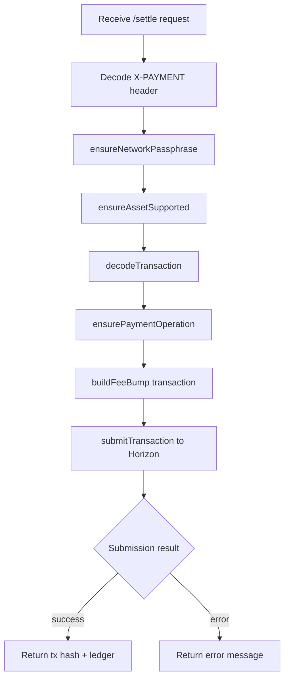
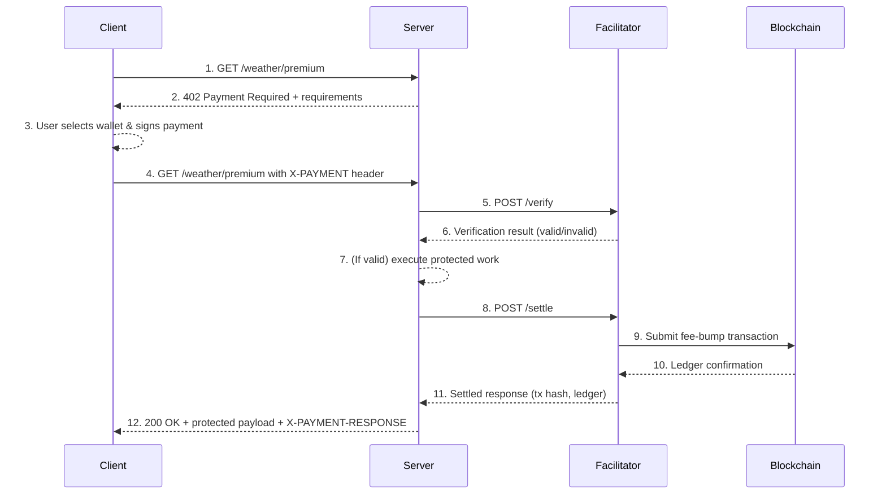

# Stellar x402 Runbook

This runbook explains how the Stellar x402 reference implementation is structured, how the components interact, and how to run, test, and troubleshoot the system end-to-end.

## Architecture Overview

The implementation mirrors the Solana x402 flow with Stellar-specific primitives:

- **Facilitator (`packages/facilitator-stellar`)**: Accepts signed payment intents, verifies them against the resource requirements, sponsors fees via a fee-bump transaction, and submits to Horizon.
- **Client helpers (`packages/client-stellar`)**: Browser-safe utilities to build payment transactions, track balances, encode/decode the `X-PAYMENT` header, and format Stellar-specific metadata.
- **Resource server middleware (`packages/middleware-resource-stellar`)**: Express middleware that enforces x402 payments. When a protected route is accessed, it emits a `402 Payment Required` payload. After receiving a valid `X-PAYMENT` header it calls the facilitator (`/verify` → `/settle`) before releasing content.
- **Paywall UI (`apps/paywall-stellar`)**: Vite/React frontend that integrates Stellar Wallets Kit, prompts the user to sign the transaction, packages the signed XDR into the x402 header, replays it to the resource server, and displays the protected content.
- **Example resource server (`apps/resource-server-stellar`)**: Small Express app that protects `/weather/premium` using the middleware and proxies to the facilitator.

### Data Flow

1. Browser requests resource
2. Resource server responds with `402` + payment requirements (payee, asset, amount in stroops, fee sponsor, timeouts)
3. Paywall builds/signs the payment transaction via wallet kit
4. Paywall encodes the signed XDR into the `X-PAYMENT` header using `client-stellar`
5. Resource server receives request with header → forwards to facilitator `/verify` and `/settle`
6. Facilitator decodes header, ensures asset/network/time bounds, wraps transaction in fee-bump, submits to Stellar testnet
7. On success, facilitator returns settlement details; middleware sets `X-PAYMENT-RESPONSE` and forwards to the handler; paywall unlocks content

## Workspace Layout

```
GPT implementation/
├── apps/
│   ├── paywall-stellar/               # React/Vite paywall demo
│   └── resource-server-stellar/       # Express resource server + middleware example
├── packages/
│   ├── facilitator-stellar/           # Stellar facilitator service
│   ├── client-stellar/                # Shared client utilities (browser-friendly)
│   └── middleware-resource-stellar/   # Express middleware for resource servers
└── docs/
    ├── stellar_x402_design.md         # High-level design doc
    ├── requirements-mapping.md        # Mapping of Solana → Stellar requirements
    └── stellar_x402_runbook.md        # (this file) operational guide
```

## Prerequisites

- **Node.js 20/22 or 24** (v24 tested), `pnpm` (Corepack/`npm install -g pnpm`)
- **XCode Command Line Tools** (macOS) for native dependencies
- **Stellar testnet account(s)**:
  - Fee sponsor secret (funded via Friendbot)
  - Destination wallet with `USDC:GBBD47IF6LWK7P7MDEVSCWR7DPUWV3NY3DTQEVFL4NAT4AQH3ZLLFLA5` trustline (or change asset to XLM)

## Environment Variables

| Component | Key | Description |
| --- | --- | --- |
| Facilitator | `FEE_SPONSOR_SECRET` | Secret key (S…) of the fee-sponsoring account |
| Facilitator | `SUPPORTED_ASSETS` | Comma-separated list of allowed assets (default `XLM`; include USDC when needed) |
| Facilitator | `PORT` | HTTP port (default `4021`) |
| Resource server | `PAY_TO` | Merchant destination account (G…) |
| Resource server | `ASSET` | Asset code/issuer (e.g. `USDC:GBBD47IF6…`) |
| Resource server | `MAX_AMOUNT_STROOPS` | Price in stroops (e.g. 5,000,000 = 0.5 unit) |
| Resource server | `FEE_SPONSOR` | Public key of fee sponsor (G…) surfaced to clients |
| Resource server | `NETWORK_PASSPHRASE` | `Test SDF Network ; September 2015` for testnet |
| Resource server | `CORS_ORIGIN` | Allowed origins (comma-separated) |
| Paywall | `VITE_RESOURCE_URL` | Resource endpoint to protect (default `http://localhost:4022/weather/premium`) |

## Local Development Workflow

Install dependencies once:

```bash
cd "/Users/sagar/code/Stellar/x402-1/GPT implementation"
pnpm install
```

### Start Facilitator (port 4021)

```bash
FEE_SPONSOR_SECRET=SA3UZSJKYVFKP3J6QQNYKVIYWO6XXLWNZCO7AMKVORICD6B4XVJA4D42 \
SUPPORTED_ASSETS="USDC:GBBD47IF6LWK7P7MDEVSCWR7DPUWV3NY3DTQEVFL4NAT4AQH3ZLLFLA5,XLM" \
pnpm --filter @stellar-x402/facilitator-stellar dev
```

Verify:

```bash
curl -s http://localhost:4021/supported | jq
```

### Start Resource Server (port 4022)

```bash
PAY_TO=GBICMXO573MQ2FFV63O5Z7ATYV3WEGHWETNS7LSCK62TDXZDMCEBVISQ \
FEE_SPONSOR=GDWW2EP44SZS2TALXKIP4B3IDAFB7JSINECCAKVMRZFORLGERPQCHYFB \
pnpm --filter @stellar-x402/resource-server-stellar dev
```

Test the challenge:

```bash
curl -s http://localhost:4022/weather/premium | jq
```

### Start Paywall UI (Vite dev server)

```bash
pnpm --filter @stellar-x402/paywall-stellar dev
```

Navigate to `http://localhost:5173/` and follow the prompts:

1. **Request Premium Resource** – triggers the 402 challenge
2. **Connect wallet** – via Stellar Wallets Kit module (Freighter, Albedo, etc.)
3. **Pay** – wallet signs the transaction
4. **Paywall** encodes the signed XDR → `X-PAYMENT`
5. **Resource server** verifies + settles via facilitator
6. Protected content is displayed, along with transaction hash and replay header

## Facilitator Internals



## End-to-End Sequence



## Running Automated Tests

Unit/integration suites are colocated with each package:

```bash
# Client x402 helper tests
pnpm --filter @stellar-x402/client-stellar test

# Middleware HTTP contract tests
pnpm --filter @stellar-x402/middleware-resource-stellar test

# Paywall lint (TypeScript/React)
pnpm --filter @stellar-x402/paywall-stellar lint

# Resource server + facilitator build smoke
pnpm --filter @stellar-x402/resource-server-stellar build
pnpm --filter @stellar-x402/facilitator-stellar build

# New: end-to-end handshake tests
pnpm --filter @stellar-x402/e2e-tests test
```

End-to-end tests (in `tests/e2e`) spin up the facilitator and resource server with mocked Stellar clients and exercise the full HTTP handshake between paywall, middleware, and facilitator.

## Deployment Considerations

- **Environment separation**: configure passphrases and Horizon/Soroban endpoints for testnet vs mainnet.
- **Secrets**: store `FEE_SPONSOR_SECRET` in a secure secret manager; never commit to source control.
- **Wallet compatibility**: ensure paywall modules align with the version of `@creit.tech/stellar-wallets-kit` used in production.
- **CORS**: lock down `CORS_ORIGIN` to trusted frontend origins before deploying.
- **TLS/Ingress**: run facilitator and resource server behind HTTPS-capable proxies in production.

## Troubleshooting

| Symptom | Likely Cause | Fix |
| --- | --- | --- |
| `ASSET_NOT_SUPPORTED` from facilitator | `SUPPORTED_ASSETS` missing asset | Include asset code/issuer; restart facilitator |
| `op_no_trust` Horizon error | Destination lacks trustline | Add trustline in wallet or switch asset to XLM |
| `INVALID_PAYLOAD` (`payload` required) | Resource server sent encoded string but facilitator expects object | Ensure paywall sends encoded header and facilitator decodes (already handled) |
| `global is not defined` in paywall | Browser polyfill missing | Vite config + `index.html` already shim `global`; rerun `pnpm install` |
| Wallet kit errors (wallet id undefined) | No default module provided | `useStellarWalletKit` selects first available module and logs errors |
| Facilitator 502 `Cannot read properties of undefined (reading 'type')` | Passing base64 XDR to `submitTransaction` | Fixed in `submitTransaction` to pass the transaction object directly |

## Additional Resources

- [Stellar Horizon API reference](https://developers.stellar.org/api/) – Transaction submission & result codes
- [Stellar Wallets Kit](https://github.com/creit-tech/stellar-wallets-kit) – Wallet integrations
- [Fee-bump transactions](https://developers.stellar.org/docs/encyclopedia/transactions/fee-bumps/) – Paying fees on behalf of users

Refer back to this runbook whenever you need to reconfigure accounts, onboard new developers, or diagnose production issues.


